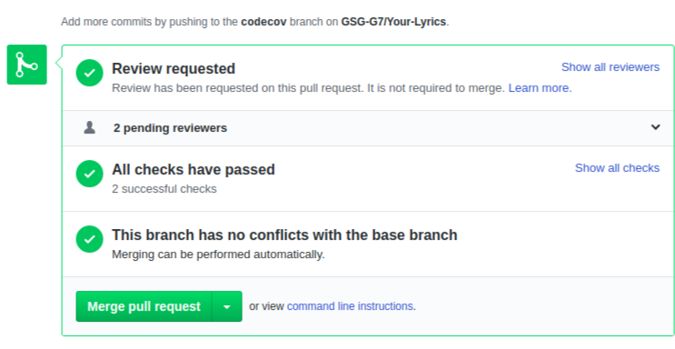
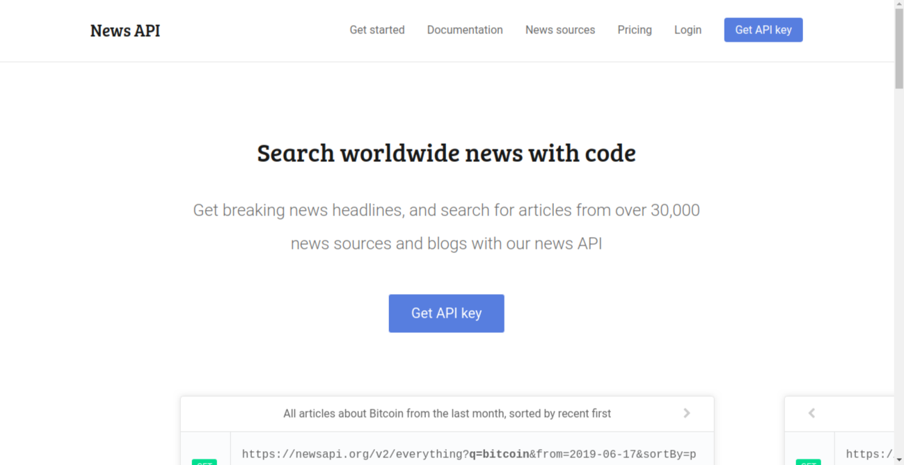

# Know-More
website to search about any News you want by Using News API.

## TEAM NAMES:
- Mossa Sameer
- Asmaa Thabet

## Our Idea : 
  a Website that display all the news related to the word searched . 

## WHY ? 
  we make this website to request API in the back end and display the response in the browser . 

## WHAT?
   Know More website is a website that help our clients to get all the News that related to the search thing they want .

## HOW?
We divided our project in to Stages:
 
* Searching for suitables API :
  we started our work by searching for the suitable API  which is should be Free and have unlimited number of requests so we choose News API .

* Design :  
  We design our project on papers to make a general perception for the website.

* Project Structure : 
  We started to build our project files Structure by seprate our project into three folders which is public,src and test to make our work more organized.

* Setup Travis in our project : 
  We setup travis in the begining of our project 
to test our project with its test step by step and we add API key to it .  

* Divided Tasks :
  We divided the work in tasks and started to work as pair in every task.

* making tests : 
  we made tests for our routes to check that they were work well .

* Fetching Data From API : 
  We work in Fetching data from API by using Node-Fetch in the back end .

* Displaying Data In Page : 
  We show our fetched data by using handle-bars files .

* Design Website : 
  We make simple design for our website to obtain the required shape from our idea .

* Use Heroku :
  we use our Heroku to connect it with github and have a link to our project . 

* checking and Fixing issues : 
  Solve The issues that appears and take suggestions in mind and try to add it all to have a great website . 

## User Journey
* The User open our Website and see Landing page that contain Input form .
* The User can type the thing that need to get News about it .
* The User click on the submit button to redirect it to the results page.
* The User will see all the news related to the searched word  .
* The User can see more informations about the news by clicking on Read More button.

## Special Features used In our project:

### Continuous Integration (CI):
we use travis for cI to check our project with the test to be sure from our work .

### Code Coverage: 
we implement code coverage by using nyc to track our test coverage and got 90.7% for stmts & lines.  

## Used API :

> The News API from [NewsAPI Website](https://newsapi.org):
  you can find it by : 
https://newsapi.org 

